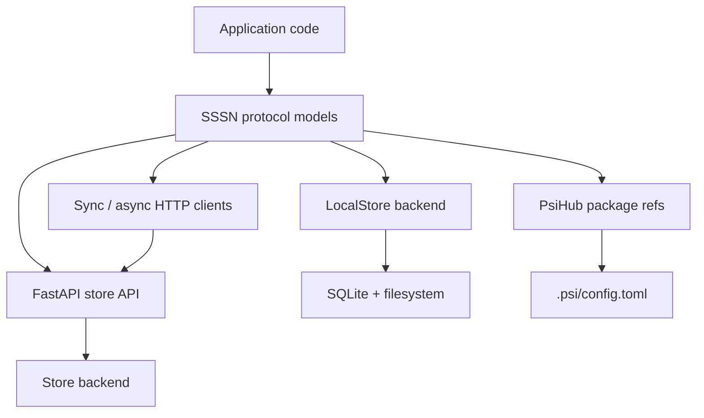

# Backend

Backend is the implementation layer behind SSSN's stable Channel abstraction.
Multiple backends can provide the same channel, event, artifact, snapshot, and
subscription contract.

The protocol is stable; the backing implementation can be a local store,
an HTTP-exposed store, an HTTP client bound to a remote store, or package
metadata that tells tools where channels live.

  

    <strong>Local Store</strong>
    SQLite metadata plus filesystem artifact bytes for deterministic local
    development.
  

  

    <strong>FastAPI Store</strong>
    A portable HTTP API exposing the same channel, event, artifact, snapshot,
    and subscription operations.
  

  

    <strong>HTTP Clients</strong>
    Sync and async clients that keep remote stores shaped like local stores.
  

  

    <strong>PsiHub</strong>
    Passive package metadata for channels, snapshots, services, and local
    config bindings.
  

## Backend Boundary

The first backend is intentionally simple so tests and examples can run
without infrastructure. Remote services and clients should preserve the same
payload envelopes, validation behavior, and error shape.

## Backend Choices

| Backend path | Use when |
| --- | --- |
| `LocalStore` | You need deterministic local state, tests, or examples. |
| FastAPI store service | You need other processes to read and write a store. |
| HTTP clients | You want local-store-like code against a remote service. |
| PsiHub refs | You want package metadata and local config to describe channels. |

## Next

- Use [Local Store](../guides/local-store.md) for local persistence.
- Use [HTTP Client](../guides/http-client.md) for remote access.
- Use [PsiHub Packages](../guides/psihub-packages.md) for package metadata.
