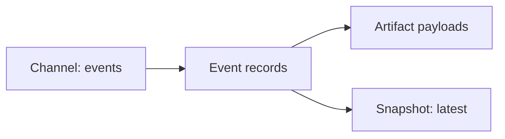

# Channels

`Channel` is SSSN's center model. A channel is a named semantic data interface
with schema, form, description, and metadata.

The protocol layer is the stable part. Stores, brokers, databases, feeds,
graph stores, object stores, and local filesystems are backing implementations
behind the channel interface.

## Design Lineage

SSSN treats a channel as a domain-neutral communication boundary. Two agentic
systems helped shape that idea:

- **Pub/sub flow for living environments.** In SocioDojo, real-world text,
  news, articles, and time-series signals flow into lifelong analytical agents
  as continuously updated societal context. SSSN keeps that pattern as
  `topic`, `log`, and `time-series` channels that services can publish to and
  workers can subscribe from.
- **Blackboard accumulation for discovery.** In Language Modeling by Language
  Models, research agents coordinate around evolving findings, experiments,
  literature, implementations, and evaluations. SSSN keeps that pattern as
  append-only events, artifacts, snapshots, and derived channels that let many
  agents accumulate shared state without sharing one runtime.

The result is deliberately neutral: the same `Channel` contract can carry news
feeds, robot traces, business events, scientific artifacts, or any other
semantic stream.

```python
from sssn import Channel

channel = Channel(
    name="events",
    schema="demo.schemas:Event",
    form="log",
    description="Local event stream.",
)
```

## Channel Forms

Common channel forms include:

| Form | Meaning |
| --- | --- |
| `log` | Append-only event history. |
| `queue` | Work queue semantics. |
| `topic` | Broadcast or pub/sub stream. |
| `latest-state` | Latest materialized state for a key. |
| `artifact-index` | Event metadata over larger payloads. |
| `time-series` | Ordered observations with temporal meaning. |

The form is metadata, not a hard-coded backend. A local SQLite store and a
future broker-backed implementation can advertise the same channel contract.

## Events, Artifacts, Snapshots

Channels group related semantic data. Events are the append-only facts.
Artifacts hold larger payload bytes. Snapshots materialize the latest state
that a worker or service wants to read quickly.



Use channels when the name carries domain meaning: `policy_samples`,
`analysis`, `robot_state`, `human_annotations`, `detections`, or
`latest_plan`.

## Validation

Channel names are portable resource names. Keep them non-empty and path-like:
letters, numbers, underscores, and hyphens are the most predictable choice.
Avoid whitespace, path separators, percent escapes, and path-control segments
so names can appear safely in URLs, refs, package cards, and local config.

## References

- Cheng, Junyan, and Peter Chin. "SocioDojo: Building Lifelong Analytical Agents
  with Real-World Text and Time Series." *The Twelfth International Conference
  on Learning Representations (ICLR)*, 2024. Spotlight.
- Cheng, Junyan, Peter Clark, and Kyle Richardson. "Language Modeling by
  Language Models." *Advances in Neural Information Processing Systems 38
  (NeurIPS 2025)*, 2025. Spotlight.
