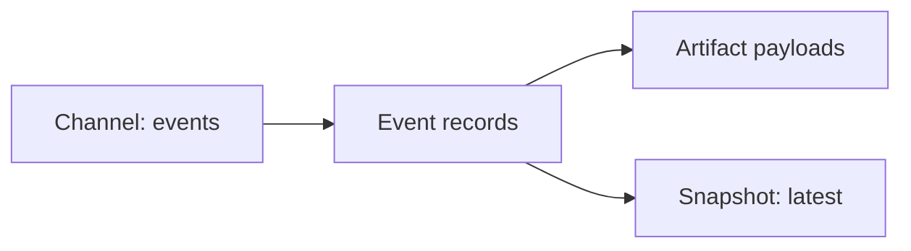

# Channels

`Channel` is SSSN's center model. A channel is a named semantic data interface
with schema, form, description, and metadata.

The protocol layer is the stable part. Stores, brokers, databases, feeds,
graph stores, object stores, and local filesystems are backing implementations
behind the channel interface.

```python
from sssn import Channel

channel = Channel(
    name="events",
    schema="demo.schemas:Event",
    form="log",
    description="Local event stream.",
)
```

## Channel Forms

Common channel forms include:

| Form | Meaning |
| --- | --- |
| `log` | Append-only event history. |
| `queue` | Work queue semantics. |
| `topic` | Broadcast or pub/sub stream. |
| `latest-state` | Latest materialized state for a key. |
| `artifact-index` | Event metadata over larger payloads. |
| `time-series` | Ordered observations with temporal meaning. |

The form is metadata, not a hard-coded backend. A local SQLite store and a
future broker-backed implementation can advertise the same channel contract.

## Events, Artifacts, Snapshots

Channels group related semantic data. Events are the append-only facts.
Artifacts hold larger payload bytes. Snapshots materialize the latest state
that a worker or service wants to read quickly.



Use channels when the name carries domain meaning: `policy_samples`,
`analysis`, `robot_state`, `human_annotations`, `detections`, or
`latest_plan`.

## Validation

Channel names are portable resource names. Keep them non-empty and path-like:
letters, numbers, underscores, and hyphens are the most predictable choice.
Avoid whitespace, path separators, percent escapes, and path-control segments
so names can appear safely in URLs, refs, package cards, and local config.
