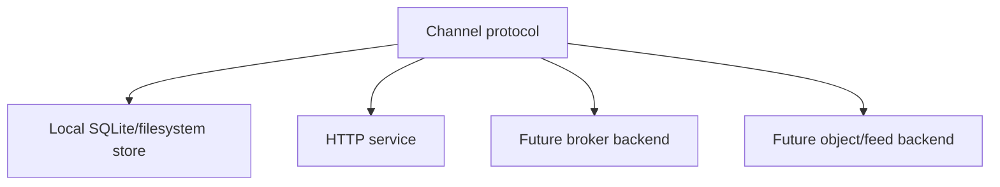

# Data Plane

SSSN is not observability. Observability systems explain how software behaves.
SSSN defines the channel protocol and service surface for data that other
systems consume.

Use SSSN for domain data moving between PSI components:

- policy samples,
- analysis results,
- robot state,
- human annotations,
- latest snapshots,
- artifacts linked to semantic events.

Use OpenTelemetry or Logfire for traces, logs, metrics, costs, and runtime
behavior.

## Backing Implementations

The backing implementation can be SQLite, a broker, a database, an object
store, a feed API, a graph store, or a remote service. The public contract
stays centered on `Channel`.

The first backend is deliberately boring: SQLite for metadata and cursors,
filesystem files for artifact payloads. That makes local development and test
fixtures deterministic.

## Processing Loops

A typical processor:

1. reads pending events from a subscription,
2. transforms each event with ordinary Python or an LLLM tactic,
3. appends derived events to another channel,
4. updates a snapshot for latest-state readers.

This keeps workers restartable. The subscription cursor records how far the
worker progressed, while the event log keeps the full history.
