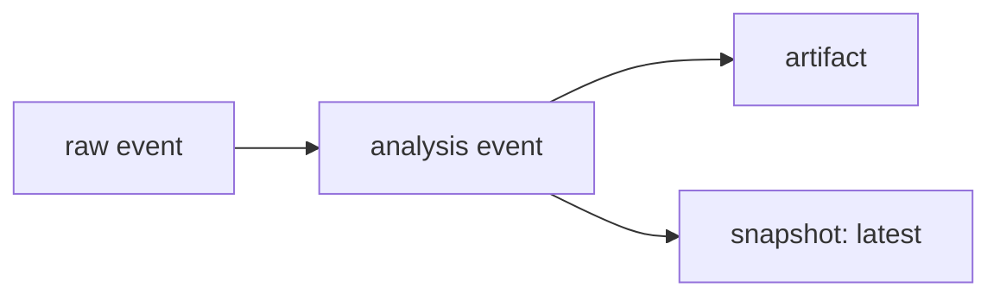

# Events, Artifacts, Snapshots

SSSN separates three data shapes so channels can carry both small semantic
records and larger payloads without turning every event into an object store.

| Resource | Use |
| --- | --- |
| `Event` | Append-only semantic record in a channel. |
| `Artifact` | Larger payload stored by reference. |
| `Snapshot` | Latest materialized state for a name. |

## Events

Events can carry schema refs, kind, source, metadata, correlation IDs, and
parent event IDs:

```python
from sssn import Event

event = Event(
    channel="events",
    source="demo",
    kind="raw",
    payload={"text": "hello"},
    correlation_id="corr-1",
)
```

Parent IDs let a derived event point back to the raw events that produced it.
Local stores reject parent IDs that do not point at existing events, which keeps
processor chains inspectable.

## Artifacts

Artifacts are for payloads that should not live inline in every event: binary
files, model outputs, reports, images, traces, or large JSON blobs.

```python
artifact = store.write_artifact(
    b"hello",
    media_type="text/plain",
    event_ids=[event.id],
    metadata={"role": "demo"},
)
payload = store.read_artifact(artifact.id)
```

Artifact metadata remains queryable without downloading payload bytes. The
payload path stays behind the store API.

## Snapshots

Snapshots hold latest materialized state:

```python
from sssn import Snapshot

store.put_snapshot(
    Snapshot(
        name="latest",
        channel="events",
        value={"status": "ok"},
        source_event_id=event.id,
    )
)
```

Snapshots can point at the event that produced their current value. That gives
readers a quick latest-state API while keeping the event log as the audit trail.


