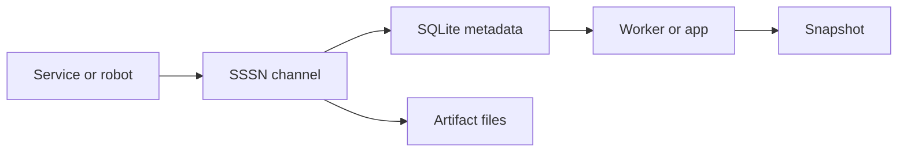

# SSSN

<p class="psi-brand">
  
</p>

[sssn.one](https://sssn.one){ .psi-domain }

SSSN is the semantic data and communication plane for Psi services. It carries
typed events, artifacts, and snapshots between services, workers, robots, apps,
and agents.

<div class="psi-tiles">
  <div class="psi-tile">
    <strong>Channel</strong>
    Named semantic data interface with schema and form metadata.
  </div>
  <div class="psi-tile">
    <strong>Event</strong>
    Append-only record with payload, schema, source, and correlation metadata.
  </div>
  <div class="psi-tile">
    <strong>Artifact</strong>
    Larger payload stored separately and linked to events.
  </div>
  <div class="psi-tile">
    <strong>Snapshot</strong>
    Latest materialized state for a key or channel.
  </div>
</div>

## Fast Path

```python
from sssn import Channel, LocalStore

store = LocalStore(".sssn")
store.create_channel(Channel(name="events", schema="demo.schemas:Event"))
event = store.append_event(
    {"channel": "events", "kind": "message", "payload": {"text": "hello"}}
)

assert store.query_events("events")[0].id == event.id
```

## Shape

<div class="psi-flow">
  <div>Producer</div>
  <div>Channel</div>
  <div>Store</div>
  <div>Consumer</div>
  <div>Snapshot</div>
</div>



## Next

- Start with [Getting Started](getting-started.md).
- Learn the center model in [Channels](concepts/channels.md).
- Follow the first tutorial in [First Channel](tutorials/first-channel.md).
