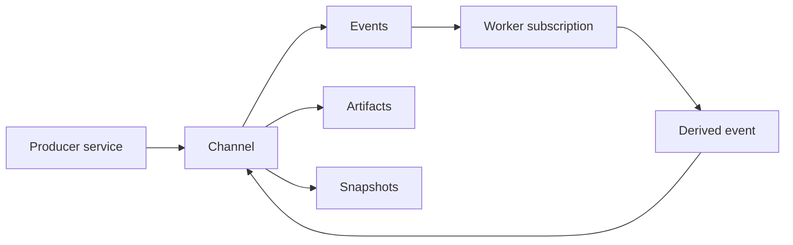

# SSSN

<p class="psi-brand">
  
  
</p>

[sssn.one](https://sssn.one){ .psi-domain }

SSSN is the protocol and service layer for semantic channels in PSI services.
It carries typed events, artifacts, and snapshots between services, workers,
robots, apps, and agents while keeping databases, brokers, feeds, object
stores, graph stores, and local filesystems behind the stable `Channel`
interface.

<div class="psi-tiles">
  <div class="psi-tile">
    <strong>Channel</strong>
    Named semantic data interface with schema, form, description, and metadata.
  </div>
  <div class="psi-tile">
    <strong>Event</strong>
    Append-only record with payload, schema, source, and correlation metadata.
  </div>
  <div class="psi-tile">
    <strong>Artifact</strong>
    Larger payload stored separately and linked back to events.
  </div>
  <div class="psi-tile">
    <strong>Snapshot</strong>
    Latest materialized state for a name, channel, or derived view.
  </div>
</div>

## Fast Path

```python
from sssn import Channel, Event, LocalStore

store = LocalStore(".sssn")
store.create_channel(Channel(name="events", schema="demo.schemas:Event"))
event = store.append_event(
    Event(channel="events", source="demo", kind="message", payload={"text": "hello"})
)

assert store.query_events("events")[0].id == event.id
```

The default local backend is intentionally boring:

```text
.sssn/
  sssn.sqlite
  artifacts/
```

SQLite owns metadata and cursors. The filesystem owns artifact payload bytes.
That simple backend gives tests, examples, demos, and local tools a stable
semantic channel layer before anyone needs a broker or hosted service.

## Shape



SSSN is not observability. Observability systems explain how software behaves.
SSSN defines the channel protocol and service surface for data that other
systems consume: policy samples, robot state, analysis results, human
annotations, and latest-state materializations.

## What SSSN Owns

- channel, event, artifact, snapshot, and subscription models,
- local store semantics and cursor validation,
- a portable HTTP service for store access,
- sync and async HTTP clients,
- PsiHub metadata helpers for channel and snapshot resources,
- shared local config resolution for SSSN refs.

## Next

- Start with [Getting Started](getting-started.md).
- Learn the center model in [Channels](concepts/channels.md).
- Follow the first tutorial in [First Channel](tutorials/first-channel.md).
- Compose with tactics in [LLLM Tactic Processor](tutorials/lllm-tactic.md).
