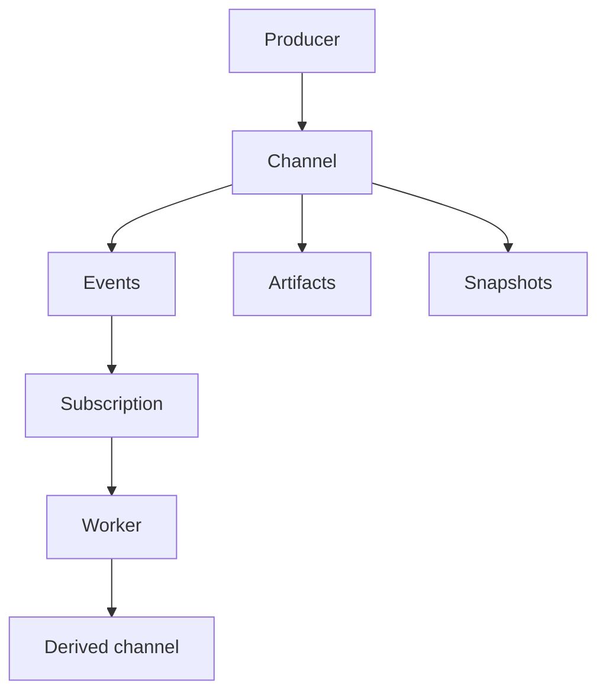

# Channel

SSSN's channel protocol is the stable contract for semantic channels. It describes how
services, workers, robots, apps, and agents name data streams, append typed
events, attach artifacts, materialize snapshots, and subscribe to new records.

The protocol does not require one storage engine. SQLite, object stores,
brokers, feeds, graph stores, or hosted services can sit behind the same
channel boundary.

## Design Concept

SSSN channels combine two core lineage patterns:

- **Societal flow.** A channel can behave like a pub/sub stream for ongoing
  inputs: news, articles, time series, claims, indicators, and other signals
  that arrive over time.
- **Scientific blackboard communication.** A channel can behave like an
  academia-style shared surface for findings, hypotheses, experiments,
  artifacts, implementations, evaluations, snapshots, and derived records. This
  is the Genesys-style discovery pattern: distributed agents publish, inspect,
  challenge, and build on a growing center of research state.

The protocol stays neutral so the same channel contract can serve society,
science, business, infrastructure, robotics, and other system-of-systems
applications. Robotics is a natural fit because SSSN's channel model is also
compatible with ROS-style topic flow, but SSSN remains a semantic data protocol
rather than robot middleware.

  

    <strong>Channel</strong>
    Named semantic interface with schema, form, description, and metadata.
  

  

    <strong>Event</strong>
    Append-only record with payload, source, kind, and correlation metadata.
  

  

    <strong>Artifact</strong>
    Larger payload stored by reference and linked back to semantic records.
  

  

    <strong>Snapshot</strong>
    Latest materialized state for a channel, name, or derived view.
  

## Shape

## What The Protocol Owns

- channel, event, artifact, snapshot, and subscription models,
- resource identifiers and portable validation rules,
- event correlation and parent links,
- artifact metadata and payload references,
- snapshot source pointers,
- HTTP service and Python client request shapes.

## What Stays Outside

- the concrete database, broker, object store, or filesystem,
- process launch and orchestration,
- package storage and cards,
- tactic/model execution,
- observability vendor formats.

That split lets a local `LocalStore` and a hosted SSSN service speak the same
language while using different backends.

## Next

- Read [Channels](../concepts/channels.md) for the center model.
- Read [Events, Artifacts, Snapshots](../concepts/events-artifacts-snapshots.md)
  for record shapes.
- Read [Data Plane](../concepts/data-plane.md) for backend ownership.
