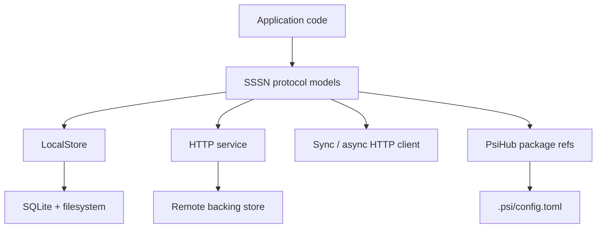

# Runtime

Runtime pages explain the implementations that sit behind the SSSN protocol
boundary.

The protocol is stable; the backing implementation can be local, HTTP-backed,
or composed with package metadata and tactics.

  

    <strong>Local Store</strong>
    SQLite metadata plus filesystem artifact bytes for deterministic local
    development.
  

  

    <strong>HTTP Service</strong>
    FastAPI service exposing the same channel, event, artifact, snapshot, and
    subscription operations.
  

  

    <strong>HTTP Client</strong>
    Sync and async clients that keep remote stores shaped like local stores.
  

  

    <strong>PsiHub</strong>
    Passive package metadata for channels, snapshots, services, and local
    config bindings.
  

## Runtime Boundary

The local runtime is intentionally simple so tests and examples can run
without infrastructure. Remote runtimes should preserve the same payload
envelopes, validation behavior, and error shape.

## Runtime Choices

| Runtime | Use when |
| --- | --- |
| `LocalStore` | You need deterministic local state, tests, or examples. |
| FastAPI service | You need other processes to read and write the store. |
| HTTP clients | You want local-store-like code against a remote service. |
| PsiHub refs | You want package metadata and local config to describe channels. |

## Next

- Use [Local Store](../guides/local-store.md) for local persistence.
- Use [HTTP Client](../guides/http-client.md) for remote access.
- Use [PsiHub Packages](../guides/psihub-packages.md) for package metadata.
